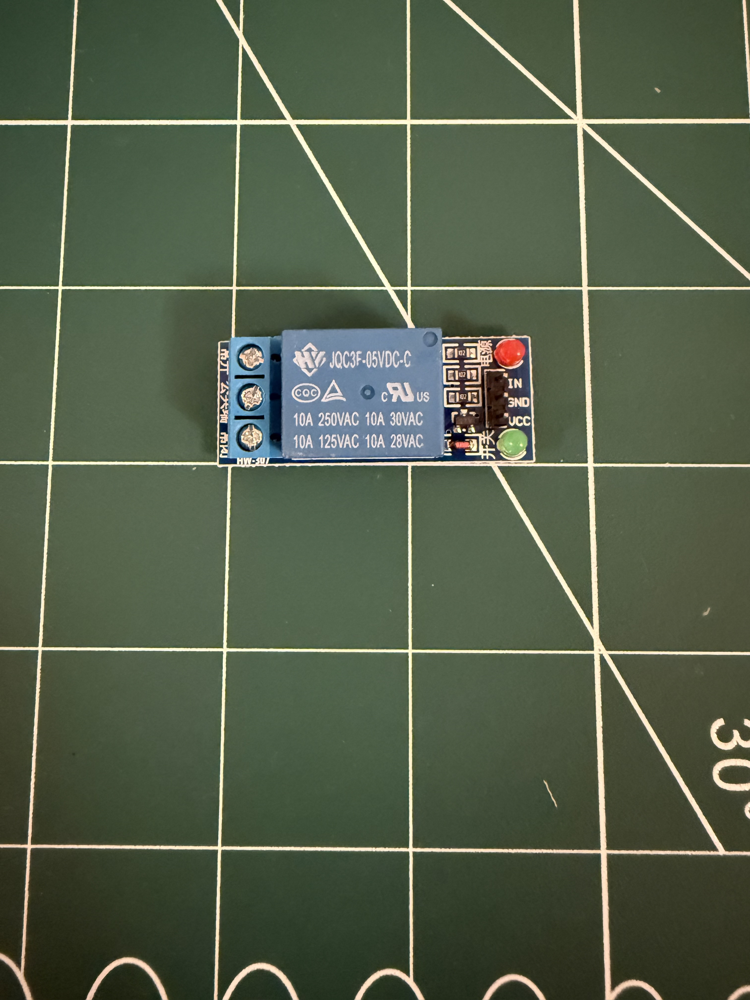
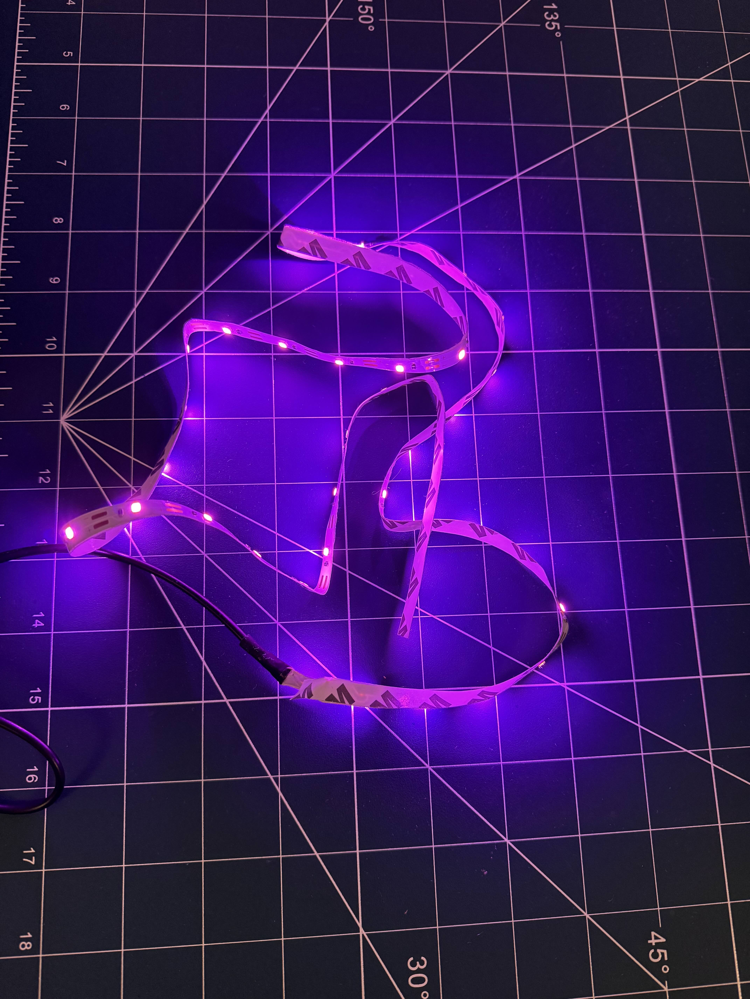
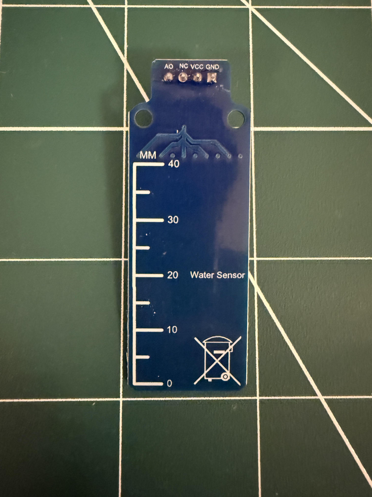
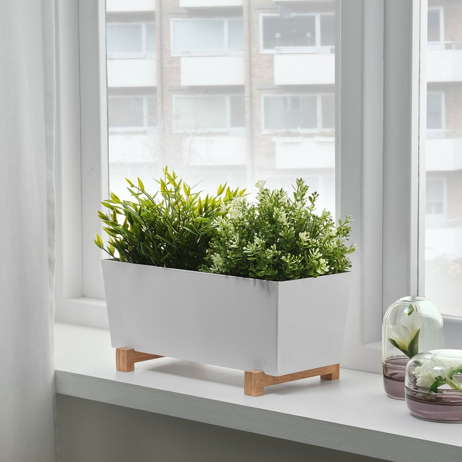
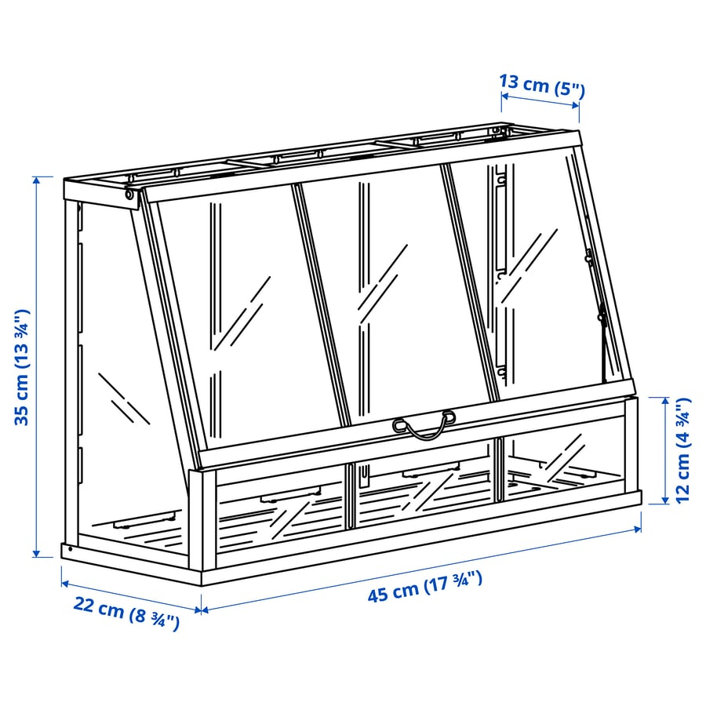

# smart-greenhouse

As part of my Mechatronics Project I will be creating a Smart Automated Greenhouse.  
As part of this project there will be a number of systems:  

* Watering system
  * 5v pump with relay control
  * Water level sensor
  * Reservoir
  * Shower head
  * Soil moisture sensor
* Lighting System
  * 12V Grow LED Strip with relay
* Air Quality System
  * 5V Fan with relay
  * VOC, Temperature, Humidity Sensors
* User Interface
  * Touch screen

## Parts

### Electronics

Relays: 5v, 12, 24v etc:  

5V Led Grow Strip:  

12V Led Grow Strip:  

CO2 Sensor:  

Soil Moisture Sensor:  

Submersible Pump:  

Water Level Sensor:  

Temperature and Humidity Sensor:  

### GreenHouse/Plant

Ikea Bittergurka Pot:

[3D Model](./3d-models/bittergurka-plant-pot-white-80285787.fbx)

Ikea Akerbaer Greenhouse:

[3D Model](./3d-models/akerbar-white-30537170.fbx)
