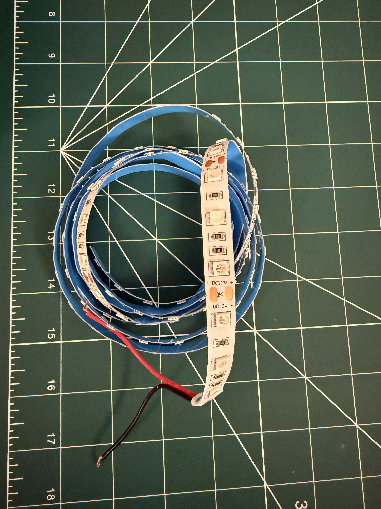
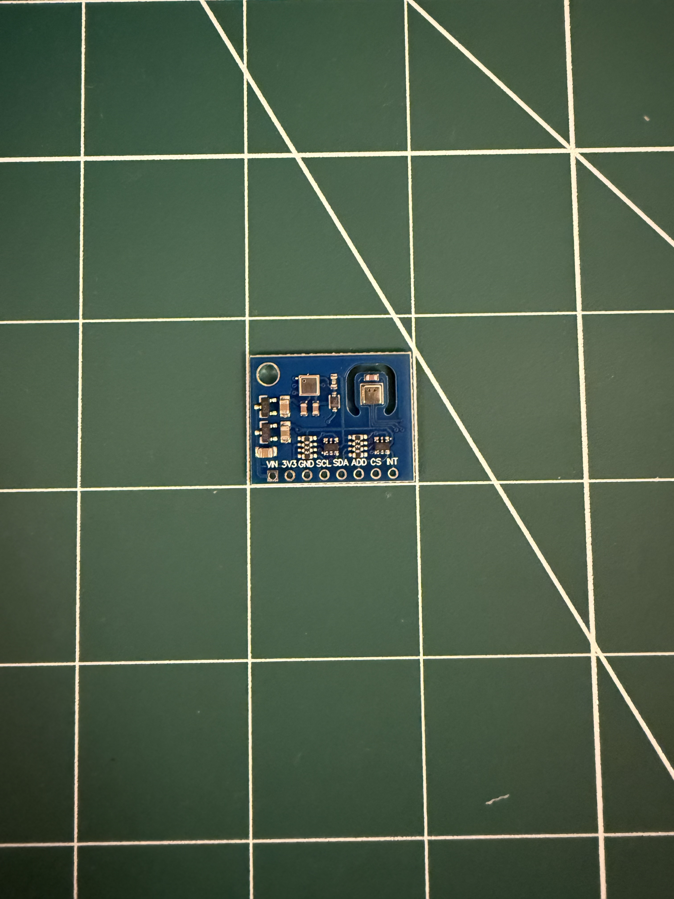
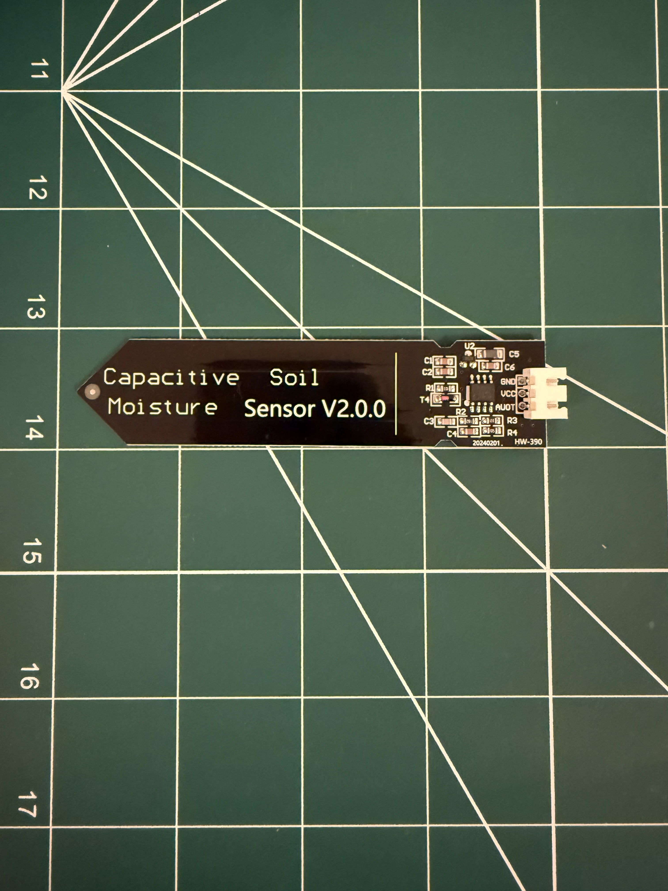
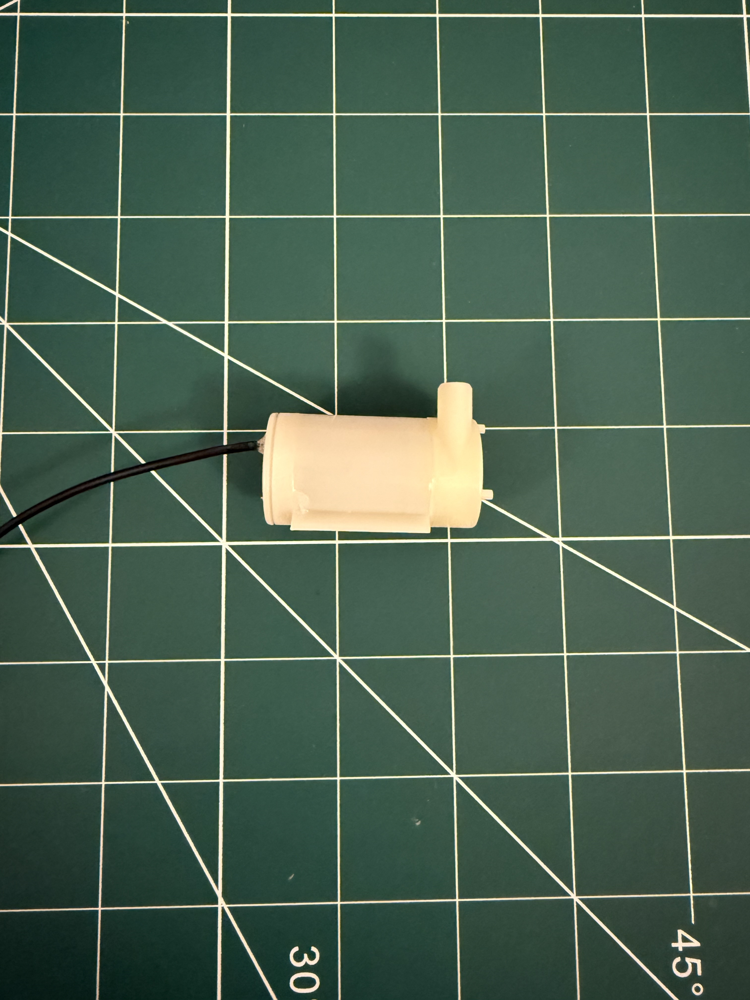
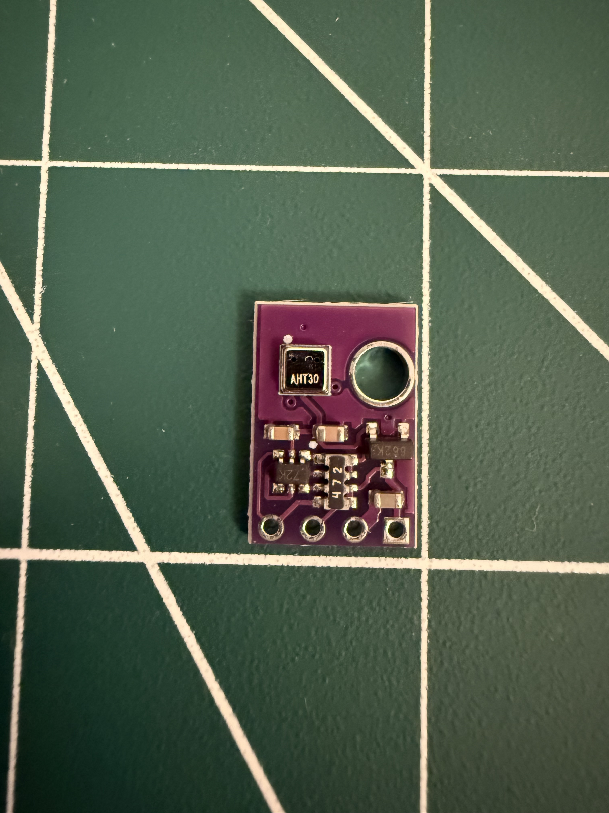

# smart-greenhouse

As part of my Mechatronics Project I will be creating a Smart Automated Greenhouse.  
Central to my design will be the [Ikea Akerbaer](https://www.ikea.com/ie/en/p/akerbaer-greenhouse-in-outdoor-white-30537170).  

## Parts

Relays: 5v, 12, 24v etc:  

5V Led Grow Strip:  

12V Led Grow Strip:  

CO2 Sensor:  

Soil Moisture Sensor:  

Submersible Pump:  

Water Level Sensor:  

Temperature and Humidity Sensor:  

