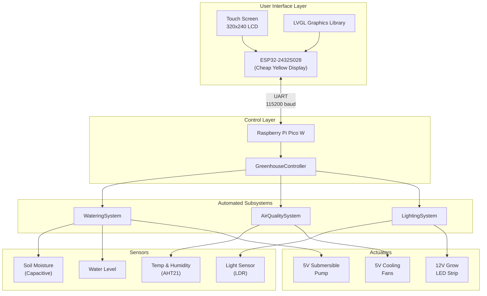
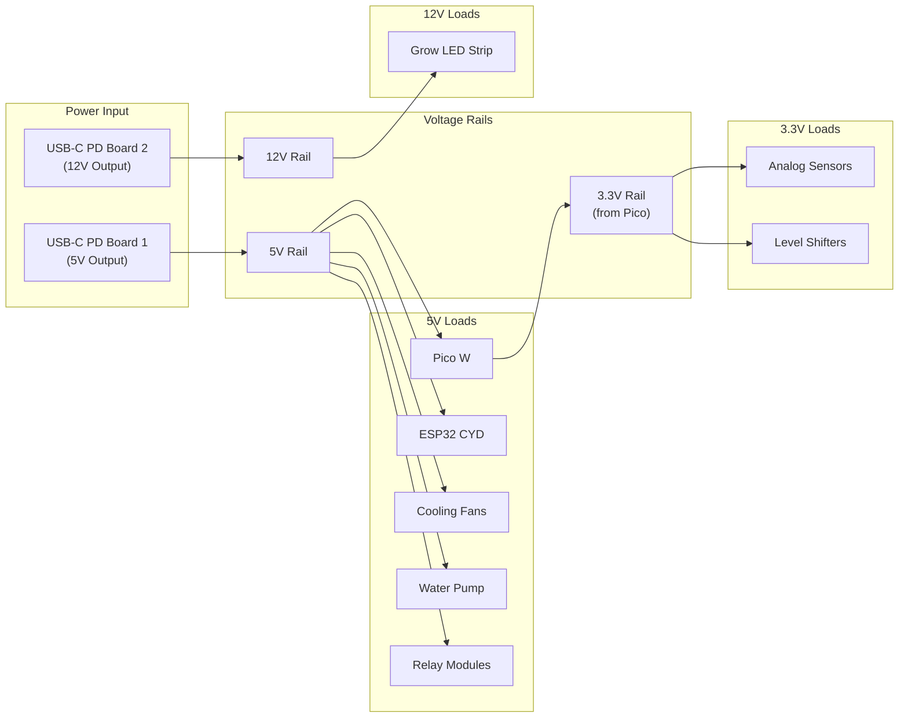
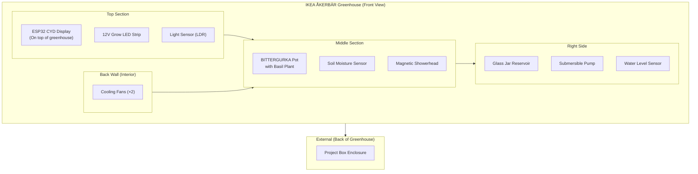
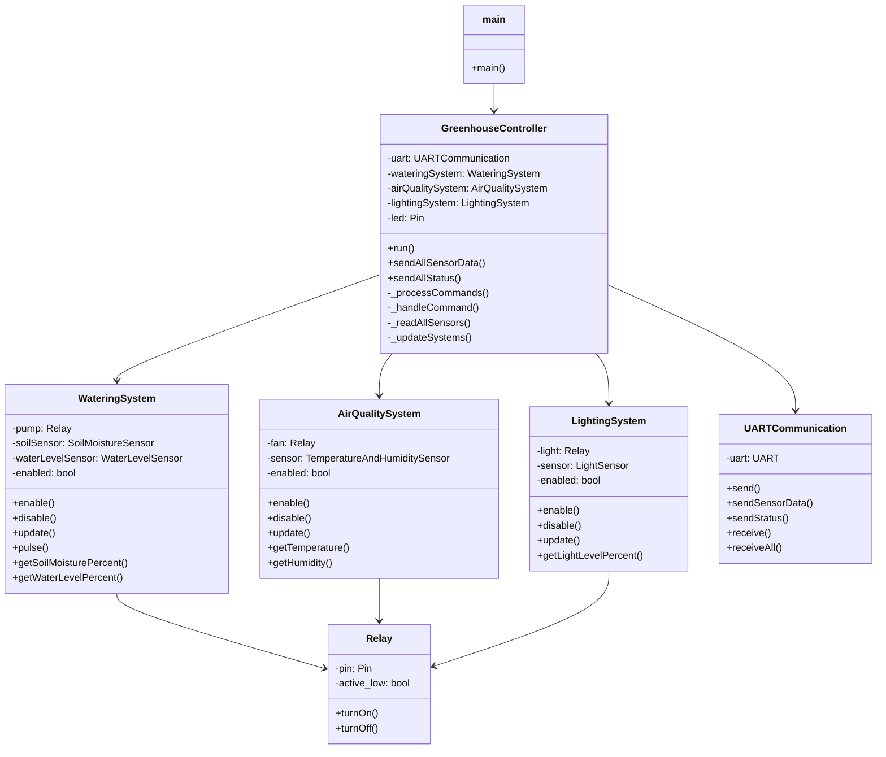
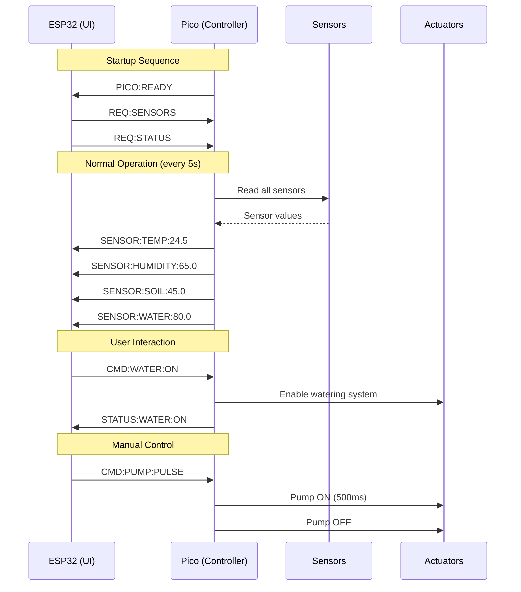

# Smart Greenhouse Control System

## Mechatronics Project Report

---

## Table of Contents

1. [Introduction](#1-introduction)
2. [System Architecture](#2-system-architecture)
3. [Hardware Design](#3-hardware-design)
4. [Physical Assembly](#4-physical-assembly)
5. [Software Design](#5-software-design)
6. [Communication Protocol](#6-communication-protocol)
7. [3D Printed Components](#7-3d-printed-components)
8. [Bill of Materials](#8-bill-of-materials)
9. [Challenges & Solutions](#9-challenges--solutions)
10. [Results & Discussion](#10-results--discussion)
11. [Conclusion & Future Work](#11-conclusion--future-work)
12. [References](#12-references)

---

## 1. Introduction

### 1.1 Project Overview

This project presents the design and implementation of a Smart Automated Greenhouse system capable of autonomously maintaining optimal growing conditions for plants. The system integrates multiple sensors, actuators, and microcontrollers to create a closed loop control system that monitors and regulates watering, lighting, and air quality without manual intervention.

### 1.2 Motivation

Indoor herb gardening presents several challenges for hobbyists and enthusiasts:

- **Inconsistent watering**: Over or under watering is a common cause of plant death
- **Inadequate lighting**: Indoor environments often lack sufficient natural light for healthy plant growth
- **Poor air circulation**: Stagnant air can lead to fungal growth and humidity problems

A smart greenhouse addresses these challenges by automating the monitoring and control of environmental conditions, ensuring plants receive optimal care even when the owner is away.

### 1.3 Objectives

The primary objectives of this project were to:

1. **Design and build an automated watering system** that delivers water based on soil moisture levels using pulse based irrigation to prevent overwatering
2. **Implement automatic grow lighting** that supplements natural light when ambient levels are insufficient
3. **Create an air quality management system** that controls temperature and humidity through ventilation
4. **Develop a touchscreen user interface** for monitoring sensor data and controlling system functions
5. **Integrate all subsystems** into a cohesive, reliable, and cost effective solution using readily available components

### 1.4 Target Application

The system is designed for growing culinary herbs such as basil and mint, which have moderate water requirements and benefit from consistent environmental conditions. The IKEA ÅKERBÄR greenhouse provides an aesthetically pleasing enclosure suitable for indoor use.

---

## 2. System Architecture

### 2.1 High Level Overview

The Smart Greenhouse employs a dual microcontroller architecture that separates concerns between user interface and control logic:



### 2.2 Design Rationale

The dual controller architecture was chosen for several reasons:

| Aspect | ESP32 (CYD) | Raspberry Pi Pico W |
|--------|-------------|---------------------|
| **Primary Role** | User Interface | Sensor/Actuator Control |
| **Programming Language** | Arduino C++ | MicroPython |
| **Key Libraries** | LVGL, TFT_eSPI | Machine, Custom Modules |
| **Processing Focus** | Graphics Rendering | Real time Control |
| **Communication** | UART TX/RX | UART TX/RX |

This separation allows:

- The ESP32 to focus on smooth UI rendering without being interrupted by sensor polling
- The Pico to maintain precise timing for sensor readings and actuator control
- Independent development and testing of UI and control logic
- Easier debugging of each subsystem

### 2.3 Subsystem Overview

The system comprises three automated subsystems:

#### Watering System

- **Trigger Condition**: Soil moisture below threshold AND water available in reservoir
- **Action**: Pulse based watering (500ms burst with 30 second cooldown)
- **Safety Feature**: Prevents pumping when reservoir is empty

#### Air Quality System

- **Trigger Conditions**:
  - Temperature > 23°C (too hot)
  - Humidity > 80% (too humid)
  - Humidity < 40% (too dry - circulate air)
- **Action**: Activate ventilation fans
- **Override**: Fan stays off if temperature < 18°C (preserve heat)

#### Lighting System

- **Trigger Condition**: Ambient light below threshold
- **Action**: Activate 12V grow LED strip

---

## 3. Hardware Design

### 3.1 Component Selection

#### 3.1.1 Microcontrollers

**Raspberry Pi Pico W**

- Dual-core ARM Cortex-M0+ @ 133MHz
- 264KB SRAM, 2MB Flash
- 26 GPIO pins with 3 ADC channels
- Built in WiFi (802.11n) for future expansion
- MicroPython support for rapid development

**ESP32-2432S028 (Cheap Yellow Display)**

- ESP32-WROOM-32 module
- Integrated 2.8" 320x240 TFT LCD with ILI9341 driver
- XPT2046 resistive touch controller
- Built in USB Serial for programming
- Cost effective all in one display solution

#### 3.1.2 Sensors

| Sensor | Type | Interface | Purpose |
|--------|------|-----------|---------|
| Capacitive Soil Moisture | Analog | ADC (GP26) | Measure soil water content |
| Water Level Sensor | Analog | ADC (GP28) | Monitor reservoir level |
| LDR Light Sensor | Analog | ADC (GP27) | Measure ambient light |
| AHT21 | Digital I2C | GP4/GP5 | Temperature & humidity |

**Sensor Specifications:**

*Capacitive Soil Moisture Sensor*
- Operating Voltage: 3.3V - 5V
- Output: Analog (inversely proportional to moisture)
- Calibration: Air ~65000 ADC, Water ~15000 ADC

*AHT21 Temperature & Humidity Sensor*
- Temperature Range: -40°C to +85°C (±0.3°C accuracy)
- Humidity Range: 0-100% RH (±2% accuracy)
- I2C Address: 0x38

#### 3.1.3 Actuators

| Actuator | Voltage | Control | Purpose |
|----------|---------|---------|---------|
| Submersible Pump | 5V | Relay (GP14) | Water delivery |
| Cooling Fans (×2) | 5V | Relay (GP15) | Ventilation |
| Grow LED Strip (2m) | 12V | Relay (GP10) | Supplemental lighting |

### 3.2 Pin Assignments

#### Raspberry Pi Pico W Pin Configuration

```
                    ┌─────────────────────┐
                    │   Raspberry Pi      │
                    │      Pico W         │
                    ├─────────────────────┤
         UART TX ──►│ GP0            GP26 │◄── Soil Moisture (ADC)
         UART RX ──►│ GP1            GP27 │◄── Light Sensor (ADC)
                    │ GND            GP28 │◄── Water Level (ADC)
                    │ GP2            GND  │
                    │ GP3            3V3  │
         I2C SDA ──►│ GP4            VREF │
         I2C SCL ──►│ GP5            GP22 │
                    │ GND            GND  │
                    │ GP6            GP21 │
                    │ GP7            GP20 │
                    │ GP8            GP19 │
                    │ GP9            GP18 │
                    │ GND            GND  │
     Light Relay ──►│ GP10           GP17 │
                    │ GP11           GP16 │
                    │ GP12           GP15 │◄── Fan Relay
                    │ GP13           GP14 │◄── Pump Relay
                    │ GND            GND  │
                    └─────────────────────┘
```

#### ESP32 CYD UART Connection

| ESP32 Pin | Function | Connection |
|-----------|----------|------------|
| GPIO 35 (RX_P3) | UART Receive | Pico GP0 (TX) |
| GPIO 22 (TX_P3) | UART Transmit | Pico GP1 (RX) |

### 3.3 Power Distribution

The system uses two USB-C Power Delivery boards to provide multiple voltage rails:



### 3.4 Level Shifting

The 5V relay modules require 5V logic signals, but the Pico W operates at 3.3V. Bidirectional level shifters are used to convert:

- 3.3V Pico GPIO → 5V Relay trigger signals

---

## 4. Physical Assembly

### 4.1 Greenhouse Structure

The project utilises IKEA furniture as the foundation:

**IKEA ÅKERBÄR Greenhouse**
- Dimensions: 45 × 22 × 35 cm
- Material: Powder coated steel with glass panels
- Provides enclosed environment with ventilation options
- Price: €19.00

**IKEA BITTERGURKA Plant Pot**
- Dimensions: 32 × 15 × 15 cm
- Material: Powder coated steel
- Positioned centrally within greenhouse
- Price: €12.00

### 4.2 Component Placement



### 4.3 Enclosure Contents

The 3D printed project box mounted on the back of the greenhouse contains:

| Component | Purpose |
|-----------|---------|
| Breadboard | Component interconnection |
| Raspberry Pi Pico W | Main controller |
| Level Shifters | 3.3V ↔ 5V conversion |
| Relay Modules (×3) | Pump, Fan, LED control |
| AHT21 Sensor | Temperature & humidity monitoring |
| USB-C PD Board (5V) | 5V power supply |
| USB-C PD Board (12V) | 12V power supply |

### 4.4 Wiring Strategy

**Connector Types:**
- **JST Connectors**: Used throughout for modularity and easy disconnection
- **RJ45 Keystone Jacks**: Used for longer cable runs (CYD power/data, LED/LDR)

**Cable Routing:**
- All wires routed under the back wall to the enclosure underside
- Standard white Ethernet cabling for RJ45 connections
- 24 AWG white wire for general connections

**RJ45 Usage:**
1. **CYD Connection**: Power (5V, GND) + Data (UART TX, RX)
2. **LED/LDR Connection**: 12V, GND, LDR signal

---

## 5. Software Design

### 5.1 Raspberry Pi Pico W (MicroPython)

#### 5.1.1 Software Architecture

The Pico software follows a modular, object oriented design:



#### 5.1.2 Main Control Loop

The main control loop executes the following sequence:

```python
while True:
    # 1. Process incoming UART commands from ESP32
    _processCommands()
    
    # 2. Read sensors periodically (every 2 seconds)
    if time_since_last_read >= SENSOR_READ_INTERVAL_MS:
        _readAllSensors()
    
    # 3. Run automatic control logic for all enabled systems
    wateringSystem.update()
    airQualitySystem.update()
    lightingSystem.update()
    
    # 4. Send data to ESP32 periodically (every 5 seconds)
    if time_since_last_send >= DATA_SEND_INTERVAL_MS:
        sendAllSensorData()
    
    # 5. Small delay to prevent busy loop
    time.sleep_ms(100)
```

#### 5.1.3 Control Algorithms

**Watering System - Pulse Irrigation:**

```python
def update(self):
    if not self.enabled:
        return
    
    # Check conditions
    if not self.isSoilDry():
        return  # Soil is moist enough
    
    if not self.hasWater():
        return  # Reservoir empty - safety check
    
    if time_since_last_pulse < PUMP_COOLDOWN_MS:
        return  # Still in cooldown period
    
    # Perform pulse watering
    self.pulse()  # 500ms burst

def pulse(self):
    self.pump.turnOn()
    time.sleep_ms(PUMP_PULSE_MS)  # 500ms
    self.pump.turnOff()
    self.lastPulseTime = time.ticks_ms()
```

**Air Quality System - Threshold Based Control:**

| Condition | Action | Reason |
|-----------|--------|--------|
| Temp > 23°C | Fan ON | Too hot |
| Temp < 18°C | Fan OFF | Preserve heat |
| Humidity > 80% | Fan ON | Too humid |
| Humidity < 40% | Fan ON | Circulate air |
| Otherwise | Fan OFF | Conditions optimal |

**Lighting System - Light Level Control:**

```python
def update(self):
    if not self.enabled:
        return
    
    rawValue = self.sensor.readRaw()
    isDark = rawValue < LIGHT_LOW_THRESHOLD
    
    if isDark:
        self._setLight(True)   # Turn on grow light
    else:
        self._setLight(False)  # Natural light sufficient
```

#### 5.1.4 Configuration Parameters

Key thresholds and timing values defined in [`config.py`](../code/raspberry-pi-pico/main/config.py):

| Parameter | Value | Description |
|-----------|-------|-------------|
| `SOIL_DRY_THRESHOLD` | 40000 | ADC value indicating dry soil |
| `WATER_LOW_THRESHOLD` | 15000 | ADC value indicating empty reservoir |
| `TEMP_HIGH_THRESHOLD` | 23.0°C | Temperature to trigger cooling |
| `TEMP_LOW_THRESHOLD` | 18.0°C | Temperature to preserve heat |
| `HUMIDITY_HIGH_THRESHOLD` | 80% | Humidity to trigger ventilation |
| `HUMIDITY_LOW_THRESHOLD` | 40% | Low humidity threshold |
| `LIGHT_LOW_THRESHOLD` | 1000 | ADC value indicating darkness |
| `PUMP_PULSE_MS` | 500ms | Duration of pump burst |
| `PUMP_COOLDOWN_MS` | 30000ms | Minimum time between pulses |
| `SENSOR_READ_INTERVAL_MS` | 2000ms | Sensor polling interval |
| `DATA_SEND_INTERVAL_MS` | 5000ms | ESP32 update interval |

### 5.2 ESP32 CYD (Arduino/LVGL)

#### 5.2.1 User Interface Design

The touch screen interface uses the LVGL (Light and Versatile Graphics Library) to provide three main screens:

**Dashboard Tab**: Sensor Readings Display:

- Temperature (°C)
- Humidity (%)
- Soil Moisture (%)
- Water Level (%)

**Auto Tab**: Automatic System Control:

- Watering System toggle (enable/disable automatic control)
- Lighting System toggle
- Air Quality System toggle
- Status indicators (LED on/off)
- Trigger condition descriptions

**Manual Tab**: Direct Device Control:

- LED toggle (on/off)
- Fan toggle (on/off)
- Pump pulse trigger (momentary button)

#### 5.2.2 UI Implementation

```cpp
void create_gui() {
    tabview = lv_tabview_create(lv_screen_active());
    lv_tabview_set_tab_bar_size(tabview, 26);

    lv_obj_t *dash = lv_tabview_add_tab(tabview, "Dashboard");
    lv_obj_t *ctrl = lv_tabview_add_tab(tabview, "Auto");
    lv_obj_t *opts = lv_tabview_add_tab(tabview, "Manual");

    create_dashboard(dash);  // Sensor readings
    create_auto(ctrl);       // System toggles
    create_manual(opts);     // Direct controls
}
```

#### 5.2.3 Dependencies

| Library | Version | Purpose |
|---------|---------|---------|
| LVGL | 9.4.0 | Graphics rendering |
| TFT_eSPI | 2.5.43 | Display driver |
| XPT2046_Touchscreen | 1.4 | Touch input |

---

## 6. Communication Protocol

### 6.1 UART Configuration

| Parameter | Value |
|-----------|-------|
| Baud Rate | 115200 |
| Data Bits | 8 |
| Parity | None |
| Stop Bits | 1 |
| Line Terminator | `\n` (newline) |

### 6.2 Message Format

All messages are ASCII text terminated with a newline character.

#### 6.2.1 Sensor Data (Pico → ESP32)

```
SENSOR:<TYPE>:<VALUE>
```

| Type | Example | Description |
|------|---------|-------------|
| TEMP | `SENSOR:TEMP:24.5` | Temperature in °C |
| HUMIDITY | `SENSOR:HUMIDITY:65.0` | Relative humidity % |
| SOIL | `SENSOR:SOIL:45.0` | Soil moisture % |
| WATER | `SENSOR:WATER:80.0` | Water level % |

#### 6.2.2 Status Updates (Pico → ESP32)

```
STATUS:<SYSTEM>:<STATE>
```

| System | States | Example |
|--------|--------|---------|
| WATER | ON/OFF | `STATUS:WATER:ON` |
| LIGHT | ON/OFF | `STATUS:LIGHT:OFF` |
| AIR | ON/OFF | `STATUS:AIR:ON` |

#### 6.2.3 Commands (ESP32 → Pico)

**Request Commands:**
| Command | Response |
|---------|----------|
| `REQ:SENSORS` | All sensor data |
| `REQ:STATUS` | All system statuses |

**System Control Commands:**
| Command | Action |
|---------|--------|
| `CMD:WATER:ON` | Enable watering system |
| `CMD:WATER:OFF` | Disable watering system |
| `CMD:LIGHT:ON` | Enable lighting system |
| `CMD:LIGHT:OFF` | Disable lighting system |
| `CMD:AIR:ON` | Enable air quality system |
| `CMD:AIR:OFF` | Disable air quality system |

**Manual Device Commands:**
| Command | Action |
|---------|--------|
| `CMD:LED:ON` | Turn grow LED on |
| `CMD:LED:OFF` | Turn grow LED off |
| `CMD:FAN:ON` | Turn fan on |
| `CMD:FAN:OFF` | Turn fan off |
| `CMD:PUMP:PULSE` | Trigger pump pulse |

### 6.3 Communication Flow



---

## 7. 3D Printed Components

### 7.1 Electronics Enclosure

The electronics enclosure was designed using **OpenSCAD** with the **YAPP (Yet Another Parametric Projectbox)** generator library.

#### 7.1.1 Design Evolution

| Version | Changes |
|---------|---------|
| v1 | Initial design with basic dimensions |
| v2 | Adjusted internal standoffs |
| v3 | Final version with connector cutouts |

#### 7.1.2 Features

- Parametric design allowing easy modifications
- Separate lid and base for easy assembly
- Cutouts for:
  - RJ45 keystone jacks
  - JST connectors
  - Ventilation

#### 7.1.3 Files

- [`design-v3.scad`](../3d-models/enclosure/design-v3.scad) - OpenSCAD source
- [`design-v3-bottom.stl`](../3d-models/enclosure/design-v3-bottom.stl) - Base STL
- [`design-v3-lid.stl`](../3d-models/enclosure/design-v3-lid.stl) - Lid STL

#### 7.1.4 Planned Improvements

As noted in the enclosure README, future revisions will add:

- Hole for soil sensor connector (3-pin)
- Hole for light sensor connector (2-pin)
- Switch water level connector to 3-pin (currently using 2× 2-pin)

### 7.2 Showerhead

A custom showerhead was designed using **Fusion 360** for even water distribution over the soil surface.

#### 7.2.1 Design Specifications

- **Shape**: Rectangular box with internal cavity
- **Water Inlet**: Hollow cylinder into cavity
- **Water Outlets**: Holes drilled in bottom (post-printing)
- **Mounting**: Magnets glued to 3D model for easy attachment/removal

#### 7.2.2 Attachment Method

Magnets are glued to the showerhead body, allowing it to:

- Attach securely to the steel BITTERGURKA pot rim
- Be easily removed for cleaning or maintenance
- Self align with the planting area

---

## 8. Bill of Materials

### 8.1 Complete Parts List

| Item | Source | Qty | Unit Cost (€) | Total (€) |
|------|--------|-----|---------------|-----------|
| 5V Relay | AliExpress | 2 | 1.50 | 3.00 |
| Soil Moisture Sensor | AliExpress | 5 | - | 3.23 |
| 12V Grow LED (2m) | AliExpress | 1 | 3.55 | 3.55 |
| 24 AWG White Wire (5m) | AliExpress | 1 | 2.34 | 2.34 |
| Cheap Yellow Display (CYD) | AliExpress | 1 | 9.99 | 9.99 |
| 5V Fans | Amazon | 2 | - | 6.54 |
| 5V Submersible Pumps | Amazon | 5 | - | 6.99 |
| Tubing | AliExpress | 1 | 2.00 | 2.00 |
| Water Level Sensors | AliExpress | 5 | - | 2.18 |
| RJ45 Keystone Jack | Temu | 10 | - | 5.08 |
| Adhesive Cable Clips | Temu | 50 | - | 1.72 |
| Heat Shrink Sleeve | Temu | 580 | - | 2.69 |
| Welding Heat Shrink | Temu | 1 | - | 4.91 |
| JST Connectors and Cables | Temu | 1 | - | 4.76 |
| Breadboard | Temu | 1 | - | 1.19 |
| USB-C PD Board | AliExpress | 5 | - | 4.71 |
| Temp/Humidity/CO2 Sensor (ENS160+AHT21) | AliExpress | 1 | - | 4.85 |
| Pi Pico | AliExpress | 5 | - | 9.00 |
| Level Shifter | AliExpress | 10 | - | 2.28 |
| IKEA BITTERGURKA Plant Pot | IKEA | 1 | 12.00 | 12.00 |
| IKEA ÅKERBÄR Greenhouse | IKEA | 1 | 19.00 | 19.00 |

### 8.2 Cost Summary

| Category | Cost (€) |
|----------|----------|
| Electronics & Sensors | €66.26 |
| Wiring & Connectors | €19.16 |
| Mechanical (IKEA) | €31.00 |
| **TOTAL** | **€112.01** |

*Note: Some items purchased in bulk quantities for spare parts and future projects.*

---

## 9. Challenges & Solutions

### 9.1 Electrical Challenges

#### 9.1.1 Loose Connections

**Problem**: Intermittent issues caused by loose wire connections on the breadboard, leading to unreliable sensor readings and actuator control.

**Solution**: Implemented cable clamps and strain relief to ensure secure, consistent connections. JST connectors were added at key points for modularity while maintaining connection integrity.

#### 9.1.2 USB-PD Power Compatibility

**Problem**: Not all USB power bricks properly support USB Power Delivery for the 12V rail needed by the LED strip. One power supply incorrectly output 15V, risking damage to components.

**Solution**: Tested multiple power supplies to identify compatible units. Selected verified USB-PD chargers that correctly negotiate and output 12V. Always verify output voltage before connecting loads.

#### 9.1.3 Power Surge Serial Issues

**Problem**: Power surges when actuators switch caused serial logging output to break, making debugging difficult. This occurred due to a single 5V line powering the Pico, ESP32, fans, relays, and pump.

**Solution**:  

- Added decoupling capacitors near sensitive components
- Ensured solid ground connections
- Considered separate power paths for high current loads in future revisions

#### 9.1.4 Relay Voltage Mismatch

**Problem**: Purchased 5V relay modules but the Pico W outputs 3.3V GPIO signals, insufficient to trigger the relays.

**Solution**: Implemented level shifters (3.3V to 5V) between the Pico GPIO pins and relay trigger inputs. This ensures reliable relay switching while maintaining proper logic levels.

### 9.2 Mechanical Challenges

#### 9.2.1 JST Connector Pin Length

**Problem**: Female JST connector pins were too short to make proper contact when inserted into the breadboard, causing intermittent connections.

**Solution**: Extended pins using jumper wires soldered to the JST connectors, or used adapter boards. For critical connections, switched to direct soldering with heat shrink insulation.

### 9.3 Integration Challenges

#### 9.3.1 System Integration Testing

**Problem**: Combining multiple subsystems revealed interaction issues not present during individual testing.

**Solution**: Adopted an incremental integration strategy:

1. Test each sensor/actuator individually on separate breadboards
2. Integrate one subsystem at a time with the main controller
3. Test communication with the ESP32 after each subsystem addition
4. Final full system integration testing

### 9.4 What Worked Well

#### 9.4.1 3D Enclosure Design

The YAPP (Yet Another Parametric Projectbox) system proved to be:

- Very intuitive to use
- Easy to iterate designs quickly
- Well documented with clear examples
- Flexible enough to accommodate various connector cutouts

#### 9.4.2 Showerhead Design

The custom showerhead designed in Fusion 360 was straightforward:

- Simple rectangular box geometry with internal cavity
- Hollow cylinder for water inlet
- Holes drilled post printing for water outlets
- Magnetic mounting system works reliably

---

## 10. Results & Discussion

### 10.1 System Performance

The completed Smart Greenhouse system successfully achieves all primary objectives:

| Objective | Status | Notes |
|-----------|--------|-------|
| Automated Watering | Achieved | Pulse irrigation prevents overwatering |
| Automatic Lighting | Achieved | Responds to ambient light levels |
| Air Quality Control | Achieved | Temperature and humidity regulation |
| Touch Screen Interface | Achieved | Dashboard, Auto, and Manual modes |
| System Integration | Achieved | All subsystems work together |

### 10.2 Operational Observations

**Watering System:**

- Pulse based irrigation effectively maintains soil moisture
- 30 second cooldown prevents water logging
- Water level sensor successfully prevents dry pump operation

**Lighting System:**

- 12V grow LED provides adequate supplemental light
- Light sensor correctly detects ambient conditions
- Active high relay configuration works reliably

**Air Quality System:**

- Temperature and humidity readings are accurate
- Fan activation effectively circulates air
- Threshold based control maintains stable conditions

### 10.3 Plant Growth

The system has been successfully used to grow basil and mint herbs. The automated care has resulted in consistent growth without manual intervention.

### 10.4 Photos

*[Placeholder for project photos to be added]*

- Overall greenhouse setup
- Electronics enclosure interior
- ESP32 display showing dashboard
- Plant growth progress

---

## 11. Conclusion & Future Work

### 11.1 Conclusion

This project successfully demonstrates the design and implementation of a Smart Automated Greenhouse system for indoor herb cultivation. The dual microcontroller architecture effectively separates user interface concerns from real time control, resulting in a responsive and reliable system.

Key achievements include:

- **Modular software design** enabling independent development and testing of subsystems
- **Cost effective solution** at €112.01 using readily available components
- **User friendly interface** with touch screen control and monitoring
- **Reliable automation** of watering, lighting, and ventilation

The project provided valuable experience in:

- Embedded systems programming (MicroPython and Arduino)
- Sensor integration and calibration
- Communication protocol design
- 3D printing and mechanical design
- System integration and debugging

### 11.2 Future Work

Several enhancements are planned for future development:

#### 11.2.1 Smart Home Integration

- **ESPHome Migration**: Rewrite firmware using ESPHome for seamless integration with Home Assistant
- **Apple HomeKit**: Enable control via Apple Home app using HomeKit protocol
- **Voice Control**: Add Siri/Alexa voice commands for system control

#### 11.2.2 Data Logging & Visualisation

- **Historical Data**: Store sensor readings over time in a database
- **Graphing**: Display temperature, humidity, and soil moisture trends
- **Alerts**: Push notifications for low water level or system faults

#### 11.2.3 Plant Monitoring

- **Camera Integration**: Add camera module to capture time lapse of plant growth
- **Image Analysis**: Potential for plant health monitoring using computer vision

#### 11.2.4 Hardware Improvements

- **Wiring Refinement**: Cleaner cable management and professional grade connectors
- **CO2 Monitoring**: Integrate the ENS160 sensor (already purchased) for air quality monitoring
- **Multi Zone Support**: Expand to support multiple plant pots with individual control

---

## 12. References

### 12.1 Hardware Documentation

- [Raspberry Pi Pico W Datasheet](https://datasheets.raspberrypi.com/picow/pico-w-datasheet.pdf)
- [ESP32-WROOM-32 Datasheet](https://www.espressif.com/sites/default/files/documentation/esp32-wroom-32_datasheet_en.pdf)
- [AHT21 Temperature & Humidity Sensor](https://asairsensors.com/product/aht21-sensor/)
- [ILI9341 LCD Controller](https://www.displayfuture.com/Display/datasheet/controller/ILI9341.pdf)

### 12.2 Software Libraries

- [LVGL - Light and Versatile Graphics Library](https://lvgl.io/)
- [TFT_eSPI Arduino Library](https://github.com/Bodmer/TFT_eSPI)
- [MicroPython Documentation](https://docs.micropython.org/en/latest/)
- [YAPP Projectbox Generator](https://github.com/mrWheel/YAPP_Box)

### 12.3 Component Sources

- [IKEA ÅKERBÄR Greenhouse](https://www.ikea.com/ie/en/p/akerbaer-greenhouse-in-outdoor-white-30537170/)
- [IKEA BITTERGURKA Plant Pot](https://www.ikea.com/ie/en/p/bittergurka-plant-pot-white-80285787/)

---

## Appendices

### Appendix A: Pin Configuration Summary

#### Raspberry Pi Pico W

| GPIO | Function | Component |
|------|----------|-----------|
| GP0 | UART TX | ESP32 RX |
| GP1 | UART RX | ESP32 TX |
| GP4 | I2C SDA | AHT21 Sensor |
| GP5 | I2C SCL | AHT21 Sensor |
| GP10 | Relay Output | Grow LED (Active HIGH) |
| GP14 | Relay Output | Water Pump (Active LOW) |
| GP15 | Relay Output | Cooling Fan (Active LOW) |
| GP26 | ADC Input | Soil Moisture Sensor |
| GP27 | ADC Input | Light Sensor (LDR) |
| GP28 | ADC Input | Water Level Sensor |

#### ESP32 CYD

| GPIO | Function | Component |
|------|----------|-----------|
| GPIO 22 | UART TX (P3) | Pico RX |
| GPIO 35 | UART RX (P3) | Pico TX |

### Appendix B: UART Protocol Quick Reference

```
# Sensor Data (Pico → ESP32)
SENSOR:TEMP:<value>       # Temperature °C
SENSOR:HUMIDITY:<value>   # Humidity %
SENSOR:SOIL:<value>       # Soil moisture %
SENSOR:WATER:<value>      # Water level %

# Status (Pico → ESP32)
STATUS:WATER:ON|OFF
STATUS:LIGHT:ON|OFF
STATUS:AIR:ON|OFF

# Requests (ESP32 → Pico)
REQ:SENSORS               # Request all sensor data
REQ:STATUS                # Request all system status

# System Control (ESP32 → Pico)
CMD:WATER:ON|OFF          # Enable/disable watering system
CMD:LIGHT:ON|OFF          # Enable/disable lighting system
CMD:AIR:ON|OFF            # Enable/disable air quality system

# Manual Control (ESP32 → Pico)
CMD:LED:ON|OFF            # Direct LED control
CMD:FAN:ON|OFF            # Direct fan control
CMD:PUMP:PULSE            # Trigger pump pulse
```

### Appendix C: File Structure

```
smart-greenhouse/
├── 3d-models/
│   ├── enclosure/
│   │   ├── design-v3.scad
│   │   ├── design-v3-bottom.stl
│   │   ├── design-v3-lid.stl
│   │   └── library/
│   │       └── YAPPgenerator_v3.scad
│   ├── akerbar-white-30537170.fbx
│   └── bittergurka-plant-pot-white-80285787.fbx
├── code/
│   ├── esp32-display/
│   │   └── main/
│   │       └── main.ino
│   └── raspberry-pi-pico/
│       └── main/
│           ├── main.py
│           ├── GreenhouseController.py
│           ├── WateringSystem.py
│           ├── AirQualitySystem.py
│           ├── LightingSystem.py
│           ├── UARTCommunication.py
│           ├── Relay.py
│           ├── SoilMoistureSensor.py
│           ├── WaterLevelSensor.py
│           ├── LightSensor.py
│           ├── TemperatureAndHumiditySensor.py
│           └── config.py
├── firmware/
│   └── MICROPYTHON_RPI_PICO_W-20251209-v1.27.0.uf2
├── parts/
│   └── parts-list-and-cost.csv
├── pictures/
│   ├── components/
│   ├── ikea/
│   └── pin-outs/
├── report/
│   └── report.md
└── README.md
```

---